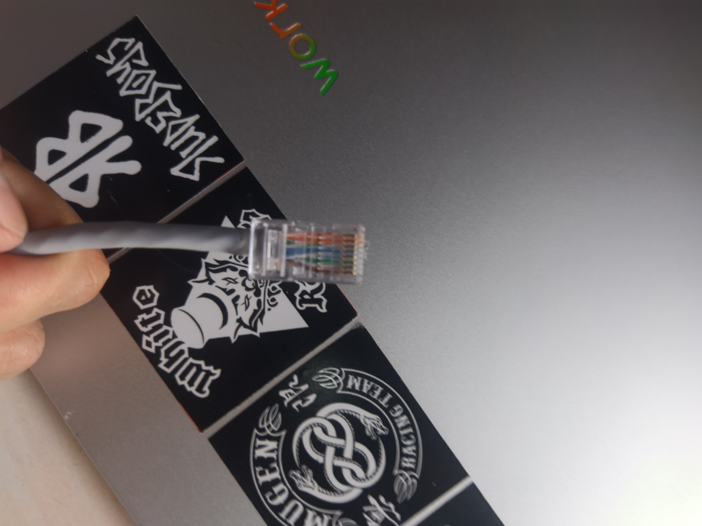

📌 Laporan Praktikum Jaringan Komputer

  <table>
        <tr>
            <th>Nama</th>
            <td>: yasyir masy'al</td>
        </tr>
        <tr>
            <th>Kelas</th>
            <td>: Tk 4 B</td>
        </tr>
        <tr>
            <th>Nim</th>
            <td>: 09030282327049</td>
        </tr>
    </table>

<h1 style="font-weight: bold;">
  JUDUL PERCOBAAN
</h1 >

<h2>Transfer File Antar Komputer via Kabel LAN dengan IP Address Versi 4 (IPv4) </h2>

<h3> Alat dan Bahan </h3>
 
 <h4>Kabel LAN</h4>

 
 
 
 <h4>2 BUAH KOMPUTER</h4>
 

<h2>Hasil Percobaan</h2>

Pada percobaan ini, saya melakukan proses Trasnfer file mengunakan kabel LAN dengan ip v4

<h3>Konfigurasi IP Address IPv4</h3>

<ol>
  <li>Tekan Windows + R </li>
  <li>Lalu ketik "ncpa.cpl"</li>
  
  <li>Configurasi Cabel LAN yang terpasang (di sini tertulis Ethernet 5 pada device saya)</li>
  
  <li>Klik Properties</li>
  
  <li>Klik Internet Protokol Version 4 (TCP/IPv4 )</li>
  
  <li>Isi nilai Ip addres dengan contoh seperti pada gambar </li>
  
  <li>Pergi kek settings -> advanced network settings </li>
  
  <li>Lalu Klik advance shareing settings </li>
  
  
  <li>Ikuti settings pada gambar </li>
  
  
  
  <li>Testing pink komputer satunya dengan alamat ip yang sudah di setting pada komputer satunya </li>
  
  
  <li>Testing pink komputer satunya dengan alamat ip yang sudah di setting pada komputer satunya </li>
  
  
   
   
  <h3> Share File </h3>

  
  <li>Pilih folder yang ingin di Share </li>
  
  
  <li>Klik kanan pada folder </li>
  
  
  <li>Pilih Give access to - Spesfik People</li>
  
  
  <li>Pilih ingin di bagikan ke siapa</li>
  
  
  <li>Pilih Everyone</li>
  
  
  <li>Edit Permision ->Read/Write </li>
  
  
  <li>susces membagikan </li>
  
  
   <h3> Output </h3>
   <li>Terlihat pada gambar bahwa file sudah berhasil di bagikan melalui LAN ke komputer satunya </li>
  
  
</ol>

<h2>Analisis Percobaan :</h2>

Berdasarkan hasil percobaan, penggunaan kabel LAN dengan konfigurasi IP Address IPv4 memungkinkan komunikasi langsung antar komputer tanpa memerlukan koneksi internet. Kecepatan transfer data yang tinggi menjadi keunggulan utama dibandingkan metode lain seperti penggunaan flash drive atau transfer melalui jaringan Wi-Fi yang lebih lambat dan rentan terhadap gangguan sinyal.

<ul>
  <li>Kecepatan Transfer: Dengan kabel LAN 100 Mbps atau 1 Gbps, kecepatan transfer file dapat mencapai puluhan hingga ratusan MBps, tergantung pada spesifikasi perangkat keras dan jenis kabel yang digunakan.</li>
  <li>Stabilitas Koneksi: Tidak seperti Wi-Fi yang bisa mengalami interferensi, transfer file menggunakan kabel LAN lebih stabil dan memiliki latensi rendah.</li>
</ul>

<h2>Kesimpulan :</h2>

Praktikum ini membuktikan bahwa transfer file antar komputer menggunakan kabel LAN dengan IP Address IPv4 adalah metode yang efisien dan stabil. Kecepatan tinggi dan keamanan menjadi keunggulan utama, meskipun terdapat keterbatasan dalam jangkauan dan fleksibilitas. Metode ini ideal digunakan dalam lingkungan jaringan lokal yang membutuhkan kecepatan dan keamanan tanpa perlu koneksi internet.

 
 

